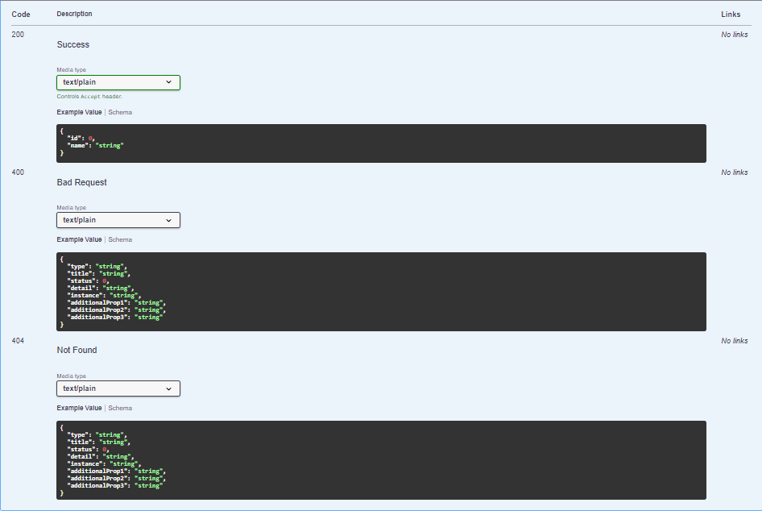
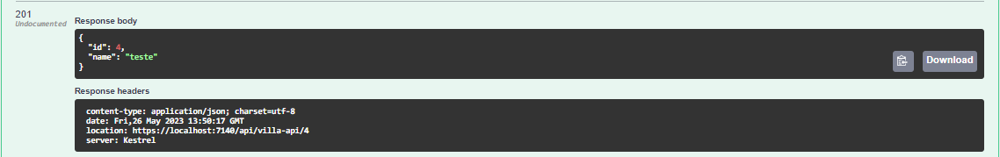
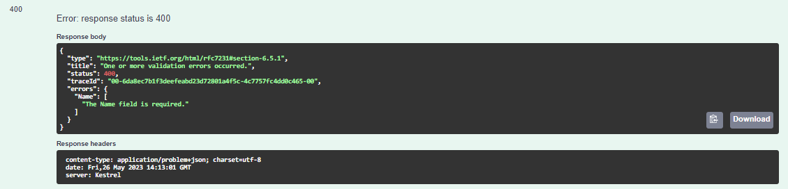
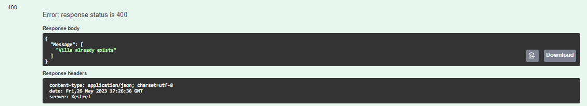

# DOTNET API

## Response overview
- ProducesResponseType data annotation could either receive an status number or an constant that describe this status
```csharp

public class Example
{

	[ProducesResponseType(200)]
	[ProducesResponseType(StatusCodes.200OK)]
	[ProducesResponseType(400)]
    [ProducesResponseType(StatusCodes.400BadRequest)]
	public ActionResult<Test> getById(int id)
	{
		...
		return Ok(entity);
	}

}

```

- The main propose of ResponseType is to document the Responses, so at swagger we have:	



if we make the method without ResponseType annotation, the return below the status code is undocumented if we make the request.

### Define the return with ResponseType annotation
it's also possible to define the return with the annotation:
```csharp

public class Example
{

	[ProducesResponseType(200, Type = typeof(TestDTO))]
	public ActionResult getById(int id)
	{
		...
		return Ok(entity);
	}

}

```

assim não seria necessário declarar o tipo do retorno no método.

## POST overview

```csharp
        [HttpPost]
        public ActionResult<VillaDTO> CreateVilla([FromBody] VillaDTO villa)
        {
            if(villa == null)
            {
                return BadRequest(villa);
            }

            if(villa.Id > 0)
            {
                return StatusCode(StatusCodes.Status500InternalServerError);
            }

            villa.Id = VillaStore.villaList.OrderByDescending(u => u.Id).FirstOrDefault().Id + 1;
            VillaStore.villaList.Add(villa);

            return CreatedAtRoute("GetVilla", new {id = villa.Id}, villa);
        }
```
Here we have an example of a post by using objects at application.

- FromBody annotation is equivalent do @RequestBody at Spring
at this application we don't want the user to set id even having id exposed at dto, so we define the id using linq by catching the last higher and increasing 1.

### CreatedAtRoute
#### this ActionResult has 3 parameters, first is the addres of our getById method:
```csharp
        [HttpGet("{id}", Name = "GetVilla")]
        [ProducesResponseType(StatusCodes.Status200OK)]
        [ProducesResponseType(StatusCodes.Status404NotFound)]
        [ProducesResponseType(StatusCodes.Status400BadRequest)]
        public ActionResult<VillaDTO> GetVilla(int id) 
        {
            if(id == 0)
            {
                return BadRequest();
            }
            var villa = VillaStore.villaList.FirstOrDefault(v => v.Id == id);
            if (villa == null)
            {
                return NotFound();
            }

            return Ok(villa);
        }
```
Note that the property 'Name' at our HttpGet helps us to define the first parameter

- the second parameter is the id to define
- and the last one is the object it self

### Return of Location:

<hr>

## Data Annotations and Model State Validation

### Data Annotation
the .NET data annotations from using System.ComponentModel.DataAnnotations; are used to valid some infos as example:

```csharp
    public class VillaDTO
    {
        public int Id { get; set; }
        [Required]
        [MaxLength(30)]
        public string Name { get; set; }
    }
```
if we try to create a new villa that doesn't match the requirements we receive an error:



- This validation works without any manipulation at our controller because we have the [ApiController] annotations, so .NET validate the objects that we return at controller.

## Model State Validation

if we put a breakpoint at our own model state validation we will realize that ApiController do that before the method

```csharp
       public ActionResult<VillaDTO> CreateVilla([FromBody] VillaDTO villa)
        {
            if (!ModelState.IsValid)
            {
                return BadRequest(ModelState);
            }
            ...
        }
```

We also could create a custom ModelState to return, like in this validation where we check if the name of villa already exists:

```csharp
        public ActionResult<VillaDTO> CreateVilla([FromBody] VillaDTO villa)
        {
            if (VillaStore.villaList.FirstOrDefault(x => x.Name.ToLower() == villa.Name.ToLower()) != null)
            {
                ModelState.AddModelError("Message", "Villa already exists");
                return BadRequest(ModelState);
            }
        }
```
The first parameter of AddModelError is the key and then the return, that will appear like that:




