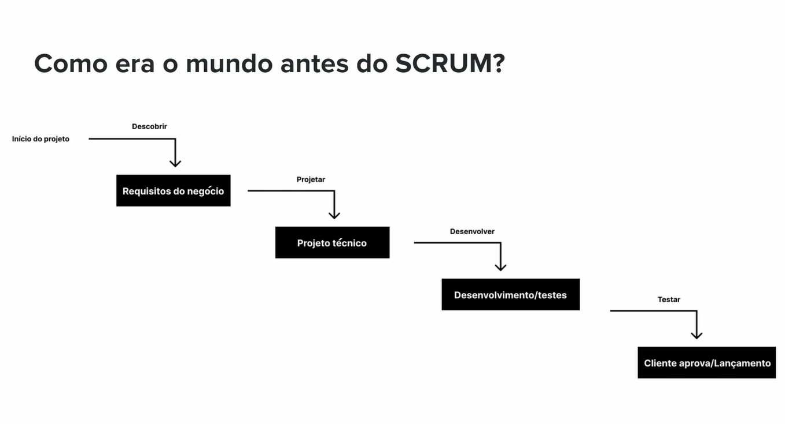
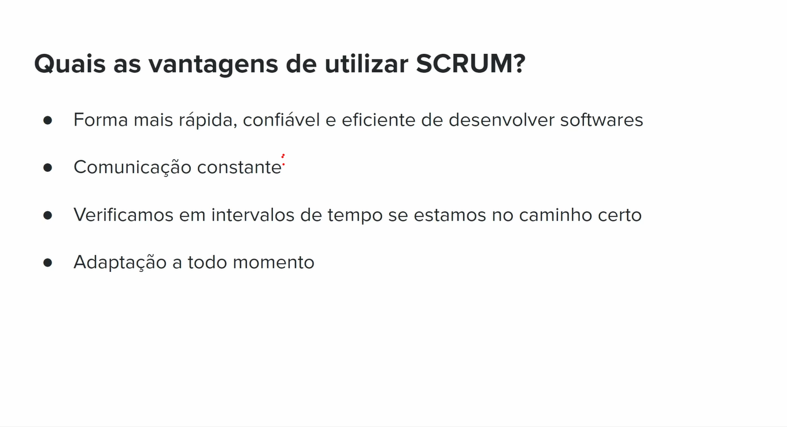

## SCRUM OVERVIEW

- Dica de livro: Scrum a arte de fazer o dobro do trabalho na metade do tempo.

### Como era o mundo antes do scrum?

#### Pontos negativos:
- Cliente pode não aprovar no final
- Projeto atrasa aumenta o orçamento
- Possível atraso pode entregar algo que o mercado não quer

### Quais as vantagens de utilizar o SCRUM?

#### Scrum Trabalha com Sprints
- Sprints devem ter tempo determinado 
- ex: 2 semanas (10 dias úteis)

## Passos

### Planning
- As tarefas são selecionadas da lista de prioridades
- A equipe faz a estimativa para as tarefas
- A equipe decide a quantidade de trabalho

#### Estimando o esforço para as tarefas
> Nós somos péssimos em estimativas de tempo

> ... mas somos bons em dimensionar por tamanho
> - imagine 3 camisas:P, M, G dimensionamos melhor do que com tempo

## Sequência de Fibonacci
 1 2 3 5 8 13 21 34 55...
> soma dos dois números anteriores

- Geralmente o máximo de uma pontuação de prioridade é 13

- Cuidado com o efeito contágio na hora de definir prioridade para a tarefa

